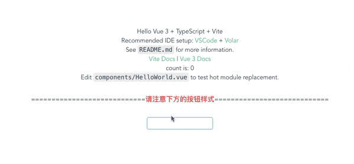

# Vite搭建的ElementPlus和TailwindCSS项目

主要结合文章展示的一个DEMO。

建议安装[Vue Language Features (Volar)](https://marketplace.visualstudio.com/items?itemName=johnsoncodehk.volar)和[Tailwind CSS IntelliSense](https://marketplace.visualstudio.com/items?itemName=bradlc.vscode-tailwindcss)两个插件。

当前分支（ `main` ）是默认全局引入ElementPlus进行测试的，当然我在 `main.ts` 中的两个样式文件顺序上做了调整，为了方便大家观察到样式问题，所以默认就用这个分支最简单的方式展示出来了。后面我会慢慢讲解其他场景的情况。

与此同时我将该Demo提交到了codesandbox，大家也看这里：[在线DEMO](https://codesandbox.io/s/full-import-elementplus-9uzlg?file=/README.md)

本项目对应的文章：

* [Vite中ElementPlus和TailwindCSS最佳实践（一）](https://www.whidy.net/vite-use-elementplus-and-tailwindcss-best-practice-1st)

## 2023年02月09日

关于这个文章对应的问题的帖子反复有人讨论，故而我又把这个老项目弄出来，大概是说结合antd的时候会有问题。有兴趣的兄弟可以进一步了解下。

我这次更新只是与时俱进，更新了依赖版本，总而言之，在使用目前最新的 `vite4.1.0` ， `element-plus2.2.29` ， `vue3.2.45` 采用按需加载的模式，简单的配置，一切都是正常的。也提供给需要的朋友做个参考。

## 2022年05月30日

特别说明：完整引入的时候，使用最新版的 `Element Plus` (**2.2.2**，实际上从**2.2.0**开始即可)及相关依赖的升级后， `el-button` 的样式问题被解决了，但这并不代表着 `main.ts` 中的样式引入顺序可以随意写了。**因为依然无法确定在其他的组件和 `Tailwindcss` 相关样式是否可能存在冲突，你仍然需要思考，并加以调整。**关于样式冲突的问题，暂时就研究到这里了。

通过观察，从2.2.0之后， `Element Plus` 对 `el-button` 组件的样式做了大幅度改动，详细可见<https://github.com/element-plus/element-plus/releases/tag/2.2.0>

如果想看之前的旧的有问题的，可以直接查看分支ID：[f3500f1a83b8fe86ae44d0d28fe58eca8e7bfc91](https://github.com/whidy/elementplus-tailwindcss-best-practice/tree/f3500f1a83b8fe86ae44d0d28fe58eca8e7bfc91)
