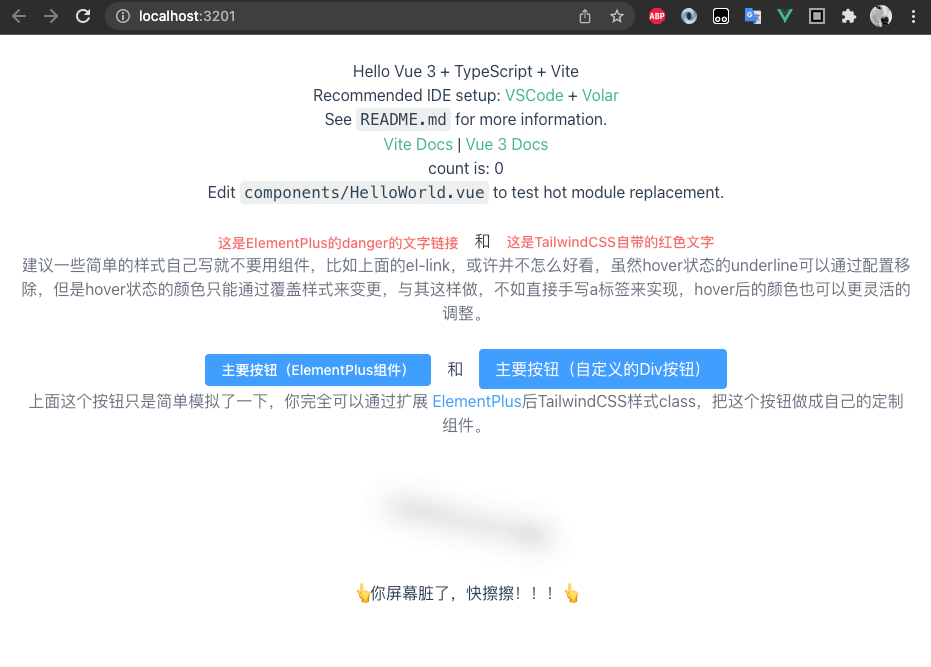

# Vite搭建的ElementPlus和TailwindCSS项目

主要结合文章展示的一个DEMO。

建议安装[Vue Language Features (Volar)](https://marketplace.visualstudio.com/items?itemName=johnsoncodehk.volar)和[Tailwind CSS IntelliSense](https://marketplace.visualstudio.com/items?itemName=bradlc.vscode-tailwindcss)两个插件。

前端项目中经常需要同时引用CSS库和UI库，比如 `TailwindCSS` 和 `ElementPlus` 一起搭配，设计稿也许完全按照ElementPlus的颜色设计，比如一些重要的或危险的文字色值采用 `"#F56C6C"` (Danger)，而TailwindCSS中的 `text-red-500` 虽然近似，但终究是无法统一的，接下来我将介绍下，如何将ElementPlus的Colors扩展到TailwindCSS中。

